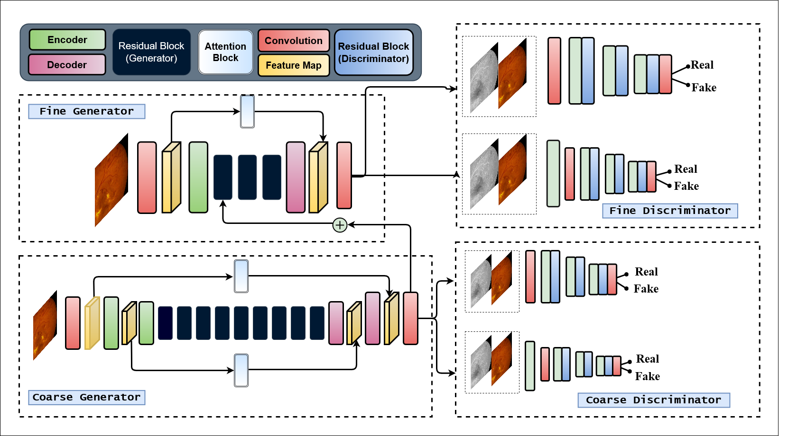

# ICPR2020 Attention2Angio

[](https://paperswithcode.com/sota/fundus-to-angiography-generation-on-fundus?p=attention2angiogan-synthesizing-fluorescein)

This code is for our paper "Attention2AngioGAN: Synthesizing Fluorescein Angiography from Retinal Fundus Images using Generative Adversarial Networks" which is part of the supplementary materials for ICPR 2020 conference. The paper has since been accpeted to ICPR 2020 and has been published.



### Arxiv Pre-print
```
https://arxiv.org/abs/2007.09191
```
### IEEE Xplore
```
https://ieeexplore.ieee.org/abstract/document/9412428
```

# Citation 
```
@INPROCEEDINGS{9412428,
  author={Kamran, Sharif Amit and Hossain, Khondker Fariha and Tavakkoli, Alireza and Zuckerbrod, Stewart Lee},
  booktitle={2020 25th International Conference on Pattern Recognition (ICPR)}, 
  title={Attention2AngioGAN: Synthesizing Fluorescein Angiography from Retinal Fundus Images using Generative Adversarial Networks}, 
  year={2021},
  volume={},
  number={},
  pages={9122-9129},
  doi={10.1109/ICPR48806.2021.9412428}
 }
```

## Pre-requisite
- Ubuntu 18.04 / Windows 7 or later
- NVIDIA Graphics card

## Installation Instruction for Ubuntu
- Download and Install [Nvidia Drivers](https://www.nvidia.com/Download/driverResults.aspx/142567/en-us)
- Download and Install via Runfile [Nvidia Cuda Toolkit 10.0](https://developer.nvidia.com/cuda-10.0-download-archive?target_os=Linux&target_arch=x86_64&target_distro=Ubuntu&target_version=1804&target_type=runfilelocal)
- Download and Install [Nvidia CuDNN 7.6.5 or later](https://developer.nvidia.com/rdp/cudnn-archive)
- Install Pip3 and Python3 enviornment
```
sudo apt-get install pip3 python3-dev
```
- Install Tensorflow-Gpu version-2.0.0 and Keras version-2.3.1
```
sudo pip3 install tensorflow-gpu==2.0.3
sudo pip3 install keras==2.3.1
```
- Install packages from requirements.txt
```
sudo pip3 install -r requirements.txt
```

### Dataset download link for Hajeb et al.
```
https://sites.google.com/site/hosseinrabbanikhorasgani/datasets-1/fundus-fluorescein-angiogram-photographs--colour-fundus-images-of-diabetic-patients
```
- Please cite the paper if you use their data
```
@article{hajeb2012diabetic,
  title={Diabetic retinopathy grading by digital curvelet transform},
  author={Hajeb Mohammad Alipour, Shirin and Rabbani, Hossein and Akhlaghi, Mohammad Reza},
  journal={Computational and mathematical methods in medicine},
  volume={2012},
  year={2012},
  publisher={Hindawi}
}
```
- Folder structure for data-preprocessing given below. Please make sure it matches with your local repository.
```
├── Dataset
|   ├──ABNORMAL
|   ├──NORMAL
```
### Dataset Pre-processing

- Type this in terminal to run the random_crop.py file
```
python3 random_crop.py --output_dir=data --input_dim=512 --datadir=Dataset
```
- There are different flags to choose from. Not all of them are mandatory.
```
    '--input_dim', type=int, default=512
    '--n_crops', type=int, default=50
    '--datadir', type=str, required=True, help='path/to/data_directory',default='Dataset'
    '--output_dir', type=str, default='data'   
```

### NPZ file conversion
- Convert all the images to npz format
```
python3 convert_npz.py --outfile_name=attention2angio --input_dim=512 --datadir=data --n_crops=50
```
- There are different flags to choose from. Not all of them are mandatory.
```
    '--input_dim', type=int, default=512
    '--n_crops', type=int, default=50
    '--datadir', type=str, required=True, help='path/to/data_directory',default='data'
    '--outfile_name', type=str, default='attention2angio'
    '--n_images', type=int, default=17
```

## Training

- Type this in terminal to run the train.py file
```
python3 train.py --npz_file=attention2angio --batch=4 --epochs=100 --savedir=AAGAN
```
- There are different flags to choose from. Not all of them are mandatory

```
   '--npz_file', type=str, default='attenton2angio', help='path/to/npz/file'
   '--batch_size', type=int, default=4
   '--input_dim', type=int, default=512
   '--epochs', type=int, default=100
   '--savedir', type=str, required=False, help='path/to/save_directory',default='AAGAN'
```

# License
The code is released under the MIT License, you can read the license file included in the repository for details.
